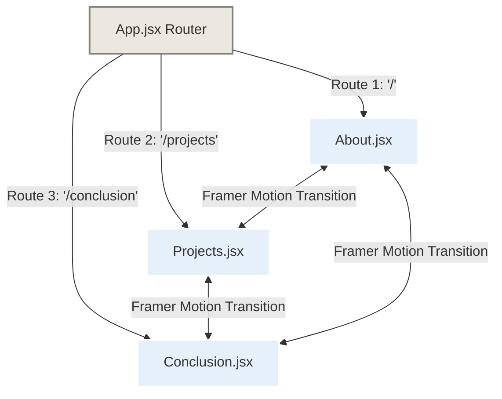

# Vyth Portfolio (vyth) - Architectural & Design Compliance Specifications

> [!IMPORTANT]
> **TÀI LIỆU TUÂN THỦ BẮT BUỘC (MANDATORY COMPLIANCE DOCUMENT)**
> Đây là đặc tả kỹ thuật và thiết kế chính thức của dự án **Vyth Portfolio** (`vyth`). Mọi lập trình viên, cộng tác viên hoặc hệ thống AI tham gia xây dựng mã nguồn phải tuân thủ nghiêm ngặt 100% các quy định về kiến trúc, cấu trúc thư mục, hệ thống phông màu, quy cách đóng gói component, và đặc biệt là hệ thống **Nền Tương Tác Phân Lớp (Interactive Layered Background System)** – điểm nhấn mỹ thuật lớn nhất của toàn hệ thống được quy định tại tài liệu này.

Chào mừng bạn đến với tài liệu đặc tả kiến trúc của **Vyth Portfolio**. Trang web là không gian nghệ thuật số và lưu trữ học thuật pháp lý cá nhân của **Trần Hà Vy**, sinh viên khoa **Luật học - Trường Đại học Luật, Đại học Quốc gia Hà Nội (VNU-UL)**.

Dự án hướng tới sự kết hợp đỉnh cao giữa **mỹ thuật tranh vẽ chì cổ điển (Academic Pencil Sketch Art Style - THEME.jpg)** và **giao diện kính mờ kỹ thuật số hiện đại (Premium Glassmorphism - GLASS.jpg)**, vận hành trên nền tảng React 18 với hệ thống chuyển động mượt mà và trực quan bậc nhất.

---

## 🛠️ Công Nghệ Phát Triển (Tech Stack)

Dự án được xây dựng và triển khai bằng các công nghệ lõi sau:

*   **Core Framework:** **React 18** (Được khởi tạo bằng **Vite** để tối ưu hóa tốc độ build và hiệu suất HMR).
*   **Animation Engine:** **Framer Motion** (Quản lý toàn bộ hiệu ứng chuyển động, dịch chuyển trang, hiệu ứng vẽ SVG và các tương tác vật lý vi mô).
*   **Smooth Scroll:** **Lenis** (`@studio-freight/react-lenis` hoặc `@darkroom.engineering/lenis`) đem lại trải nghiệm cuộn trang mượt mà, đồng đều trên tất cả các trình duyệt và thiết bị.
*   **Iconography:** **Lucide React** (`lucide-react`) cho các icon UI hiện đại, kết hợp với các **Custom SVG nét vẽ chì** để tối ưu hóa tính nghệ thuật độc đáo.
*   **Styling System:** **Vanilla CSS / CSS Modules** (Đảm bảo kiểm soát tuyệt đối các biến tùy biến (CSS Custom Properties), bộ lọc kính mờ `backdrop-filter`, các hình nền vân giấy thô và kỹ thuật tạo viền vẽ tay bất đối xứng).

---

## 🏛️ Kiến Trúc Dự Án (Architecture & Directory Structure)

Mã nguồn được cấu trúc theo mô hình Component-Driven hiện đại của React 18. Mọi tệp tin phải được đặt đúng vị trí quy định dưới đây:

```text
vyth/
├── README.md                           <-- Tài liệu tuân thủ này (Không sửa đổi nếu không có yêu cầu)
├── package.json                        <-- Quản lý dependencies (React 18, framer-motion, lenis, lucide-react)
├── vite.config.js                      <-- Cấu hình Vite tối ưu hóa build
├── index.html                          <-- Điểm neo ứng dụng React (Entry HTML)
├── public/
│   ├── assets/
│   │   ├── textures/
│   │   │   └── paper-grain.png         <-- Vân giấy mỹ thuật làm nền cho toàn bộ trang
│   │   └── documents/                  <-- Các file bài tập (PDF) được chuyển từ thư mục docs gốc
│   │       ├── Bt1.pdf
│   │       ├── Bt2.pdf
│   │       ├── Bt3.pdf
│   │       ├── Bt4.pdf
│   │       ├── bt5.PDF
│   │       └── Bt6.pdf
│   └── favicon.ico
├── src/
│   ├── main.jsx                        <-- Khởi tạo React & Tích hợp Lenis Smooth Scroll
│   ├── App.jsx                         <-- Component gốc quản lý Router SPA & layout chung
│   ├── index.css                       <-- CSS hệ thống nền, biến màu và phong cách vẽ tay
│   ├── components/                     <-- Các UI Component dùng chung chất lượng cao
│   │   ├── CustomScrollbar.jsx         <-- Thanh cuộn phong cách vẽ chì tinh tế
│   │   ├── GlassCard.jsx               <-- Thẻ kính mờ hỗ trợ tương tác 3D Parallax & Refraction
│   │   ├── HandDrawnDivider.jsx        <-- Đường phân chia vẽ chì chuyển động bằng SVG
│   │   ├── PDFViewerDrawer.jsx         <-- Cửa sổ trượt kính mờ để đọc trực tiếp file PDF
│   │   └── InteractiveBackground.jsx   <-- Bộ lõi quản lý nền tương tác nghệ thuật phân lớp (MANDATORY COMPLIANCE)
│   ├── pages/                          <-- 3 Trang Router của hệ thống
│   │   ├── About.jsx                   <-- Trang 1: Giới thiệu bản thân & Năng lực số
│   │   ├── Projects.jsx                <-- Trang 2: Danh sách 6 bài tập lớn dạng kính mờ
│   │   └── Conclusion.jsx              <-- Trang 3: Tổng kết hành trình & Định hướng tương lai
│   └── hooks/
│       ├── usePrefersReducedMotion.js
│       └── useMousePosition.js         <-- Hook theo dõi tọa độ con trỏ chuột mượt mà
└── docs/                          <-- Thư mục gốc chứa tài liệu đầu vào (Tài liệu tham khảo, tuyệt đối GIỮ NGUYÊN)
    ├── Bt1.pdf
    ├── Bt2.pdf
    ├── Bt3.pdf
    ├── Bt4.pdf
    ├── bt5.PDF
    ├── Bt6.pdf
    ├── GLASS.jpg
    ├── THEME.jpg
    └── portfolio.md
```

---

## 🚦 Kiến Trúc Định Tuyến 3 Routes (3-Route SPA Architecture)

Ứng dụng bắt buộc triển khai định tuyến **Single Page Application (SPA) với 3 Routes thực thụ** nhằm đem lại trải nghiệm liền mạch tuyệt đối. 

Quá trình chuyển đổi trang được điều phối thông qua thẻ `<AnimatePresence>` của Framer Motion để đảm bảo hiệu ứng biến mất (Exit) và xuất hiện (Entrance) diễn ra cùng lúc một cách mượt mà nhất.



### Phác thảo cấu trúc Router chuyển trang trong `App.jsx`
```jsx
import { useState } from 'react';
import { AnimatePresence, motion } from 'framer-motion';
import About from './pages/About';
import Projects from './pages/Projects';
import Conclusion from './pages/Conclusion';
import Navbar from './components/Navbar';
import InteractiveBackground from './components/InteractiveBackground';

export default function App() {
  const [currentRoute, setCurrentRoute] = useState('about'); // 'about' | 'projects' | 'conclusion'

  const pageVariants = {
    initial: { opacity: 0, y: 30, filter: 'blur(10px)' },
    animate: { opacity: 1, y: 0, filter: 'blur(0px)', transition: { duration: 0.8, ease: [0.16, 1, 0.3, 1] } },
    exit: { opacity: 0, y: -30, filter: 'blur(8px)', transition: { duration: 0.5, ease: [0.7, 0, 0.84, 0] } }
  };

  return (
    <div className="app-container">
      {/* 🌌 Điểm nhấn mỹ thuật lớn nhất: Nền phân lớp tương tác bao phủ toàn cục */}
      <InteractiveBackground currentRoute={currentRoute} />
      
      <Navbar current={currentRoute} onChange={setCurrentRoute} />
      
      <main className="main-content relative z-10">
        <AnimatePresence mode="wait">
          {currentRoute === 'about' && (
            <motion.div key="about" variants={pageVariants} initial="initial" animate="animate" exit="exit">
              <About />
            </motion.div>
          )}
          {currentRoute === 'projects' && (
            <motion.div key="projects" variants={pageVariants} initial="initial" animate="animate" exit="exit">
              <Projects />
            </motion.div>
          )}
          {currentRoute === 'conclusion' && (
            <motion.div key="conclusion" variants={pageVariants} initial="initial" animate="animate" exit="exit">
              <Conclusion />
            </motion.div>
          )}
        </AnimatePresence>
      </main>
    </div>
  );
}
```

---

## 🌌 Hệ Thống Nền Tương Tác Phân Lớp (Interactive Background System)

Bộ nền là **linh hồn thẩm mỹ** của dự án Vyth Portfolio. Nó chứa nhiều assets nghệ thuật nhất, chuyển động tinh xảo và dày đặc nhất để hỗ trợ thị giác cho các thẻ kính mờ (glassmorphism cards) nổi phía trên. 

Nền được chia làm **4 tầng chiều sâu (4 Depth Layers)** vận hành song song và tối ưu hiệu suất tuyệt đối ở tần số 60 FPS:

```mermaid
grid-layout
    L1[Layer 1: Canvas Giấy Mỹ Thuật Ấm Áp]
    L2[Layer 2: Hạt Bụi Than Chì Sinh Học]
    L3[Layer 3: Tranh Vẽ Chì Nghệ Thuật Cuộn Phác Thảo]
    L4[Layer 4: Biến Biến Nét Vẽ Trừu Tượng Theo Route]
```

### 1. Chi tiết Đặc tả Kỹ thuật của 4 Lớp Nền (Layer-by-Layer Specs)

#### Tầng 1: Canvas Giấy Mỹ Thuật Ấm Áp (Base Art Paper - L1)
*   **Vận hành:** Sử dụng vân nền `paper-grain.png` có độ thô nhẹ phủ toàn màn hình. 
*   **Chuyển động:** Sử dụng kỹ thuật chuyển dịch màu (dynamic color washing) cực kỳ chậm rãi bằng CSS keyframe, thay đổi sắc độ nền từ màu kem ấm sang ngả xám nhẹ và ngược lại trong vòng 30 giây để nền "thở" tự nhiên:
    ```css
    @keyframes paperBreath {
      0% { background-color: #F4F1EA; }
      50% { background-color: #ECE7DC; }
      100% { background-color: #F4F1EA; }
    }
    ```

#### Tầng 2: Hệ thống Hạt Bụi Than Chì Tương Tác (Generative Graphite Particles - L2)
*   **Assets:** Sử dụng HTML5 Canvas để sinh ngẫu nhiên khoảng 60–80 hạt bụi than chì (graphite dust/shavings) có kích thước siêu mảnh từ 0.5px đến 2px, màu xám mờ với độ trong suốt ngẫu nhiên (`rgba(32, 32, 32, 0.05)` đến `0.2`).
*   **Vật lý chuyển động (Physics):**
    *   **Trôi theo quán tính cuộn (Scroll Inertia):** Liên kết tốc độ rơi thẳng đứng của hạt với vận tốc cuộn trang của **Lenis**. Khi người dùng lướt nhanh, các hạt bụi chì sẽ cuộn/bay nhanh lên hoặc rơi mạnh xuống tương ứng với lực cuốn quán tính.
    *   **Lực hút từ con trỏ chuột (Mouse Attractor):** Hạt chuyển động theo dạng Brown lơ lửng, nhưng khi con trỏ chuột ở gần phạm vi 150px, hạt sẽ chịu một gia tốc hướng tâm nhẹ bay tụ lại xung quanh chuột tạo hiệu ứng gió cuốn bụi than độc đáo.

#### Tầng 3: Tranh Vẽ Chì Tác Phẩm Cổ Điển (Scroll-Triggered Masterpiece Sketches - L3)
*   **Assets:** Các file phác họa nét vẽ chì nghệ thuật độ phân giải cao (`hero-about.jpg`, `projects-bg.jpg`, `conclusion.jpg`) được vẽ bán trong suốt dưới dạng **nền chìm Parallax**.
*   **Chuyển động phác thảo (Drawing Entrance):** Khi cuộn trang đến một vùng chỉ định, các bức tranh nền tương ứng không hiển thị đột ngột mà chạy hiệu ứng **tự vẽ nét viền** bằng SVG phác thảo (`stroke-dasharray` & `stroke-dashoffset` chạy từ 1 đến 0), sau đó dải màu chì than mới từ từ hiện hình (fade-in opacity) tạo trải nghiệm giống như tranh đang được vẽ trực tiếp trước mắt người xem.

#### Tầng 4: Hệ thống Nét Chì Hình Học Trừu Tượng Tương Tác Route (Contextual Route Morphing - L4)
*   **Assets:** Các đường lưới mờ phác họa phối cảnh kiến trúc, các cung tròn toán học học thuật và văn bản luật La Mã viết tay cực mảnh phác bằng chì 2B chìm sâu dưới nền.
*   **Chuyển động biến hình (Morphing):** Khi `currentRoute` thay đổi, hệ thống đường nét chì trừu tượng này sẽ tự dịch chuyển, co giãn hoặc xoay góc (`transform` & `SVG morphing path`) để thay đổi bố cục nền phù hợp với từng ngữ cảnh:
    *   **Tại `/` (About):** Nét chì nền tụ lại tạo dáng cuốn sách cổ và các cung hoa văn tròn thanh lịch xung quanh chân dung.
    *   **Tại `/projects`:** Các nét chì nền giăng ra thành các đường kẻ lưới kỹ thuật số, tạo điểm neo kết nối các Glass Card như một bản vẽ kỹ thuật kiến trúc.
    *   **Tại `/conclusion`:** Các nét chì uốn lượn tạo hình cổng vòm thư viện hoặc đại lộ thênh thang hướng về phía trước.

---

### 2. Cài Đặt Trình Quản Lý Nền Tương Tác (`InteractiveBackground.jsx`)

Lập trình viên bắt buộc phải triển khai cấu trúc lõi dưới đây cho component nền để đảm bảo liên kết chuyển động và hiệu suất đỉnh cao:

```jsx
// src/components/InteractiveBackground.jsx
import { useEffect, useRef } from 'react';
import { motion, useScroll, useTransform, useSpring } from 'framer-motion';
import useMousePosition from '../hooks/useMousePosition';

export default function InteractiveBackground({ currentRoute }) {
  const canvasRef = useRef(null);
  const mouse = useMousePosition(); // Trả về { x, y } tức thời của con trỏ
  const { scrollY } = useScroll();
  
  // Tạo lò xo chuyển động mượt mà cho Parallax nền chìm
  const springConfig = { stiffness: 60, damping: 20, mass: 1 };
  const parallaxX = useSpring(useTransform(scrollY, [0, 1000], [0, -50]), springConfig);
  const parallaxY = useSpring(useTransform(scrollY, [0, 1000], [0, -100]), springConfig);
  
  useEffect(() => {
    const canvas = canvasRef.current;
    if (!canvas) return;
    const ctx = canvas.getContext('2d');
    let animationFrameId;
    
    // Khởi tạo hệ thống hạt than chì (L2)
    let particles = [];
    const particleCount = 70;
    
    const resizeCanvas = () => {
      canvas.width = window.innerWidth;
      canvas.height = window.innerHeight;
    };
    window.addEventListener('resize', resizeCanvas);
    resizeCanvas();
    
    class GraphiteParticle {
      constructor() {
        this.reset();
      }
      
      reset() {
        this.x = Math.random() * canvas.width;
        this.y = Math.random() * canvas.height;
        this.vx = (Math.random() - 0.5) * 0.4;
        this.vy = Math.random() * 0.5 + 0.2;
        this.size = Math.random() * 1.5 + 0.5;
        this.alpha = Math.random() * 0.15 + 0.05;
      }
      
      update(mouseX, mouseY) {
        // Trôi xuống cơ bản
        this.x += this.vx;
        this.y += this.vy;
        
        // Tương tác vật lý hấp dẫn với chuột
        const dx = mouseX - this.x;
        const dy = mouseY - this.y;
        const dist = Math.sqrt(dx * dx + dy * dy);
        
        if (dist < 150) {
          const force = (150 - dist) / 150;
          this.x += (dx / dist) * force * 1.2;
          this.y += (dy / dist) * force * 1.2;
        }
        
        // Tái sinh hạt khi trôi ra ngoài biên màn hình
        if (this.y > canvas.height || this.x < 0 || this.x > canvas.width) {
          this.reset();
          this.y = 0;
        }
      }
      
      draw() {
        ctx.beginPath();
        ctx.arc(this.x, this.y, this.size, 0, Math.PI * 2);
        ctx.fillStyle = `rgba(32, 32, 32, ${this.alpha})`;
        ctx.fill();
      }
    }
    
    for (let i = 0; i < particleCount; i++) {
      particles.push(new GraphiteParticle());
    }
    
    // Vòng lặp render tối ưu 60 FPS
    const renderLoop = () => {
      ctx.clearRect(0, 0, canvas.width, canvas.height);
      
      // Cập nhật và vẽ từng hạt
      particles.forEach(p => {
        p.update(mouse.x, mouse.y);
        p.draw();
      });
      
      animationFrameId = requestAnimationFrame(renderLoop);
    };
    
    renderLoop();
    
    return () => {
      cancelAnimationFrame(animationFrameId);
      window.removeEventListener('resize', resizeCanvas);
    };
  }, [mouse]);

  return (
    <div className="interactive-background-system fixed inset-0 overflow-hidden pointer-events-none z-0">
      {/* L1: Vân giấy thô & Chuyển dịch màu ấm */}
      <div className="absolute inset-0 bg-paper-breath" />
      
      {/* L2: Hệ thống hạt than chì tương tác Canvas */}
      <canvas ref={canvasRef} className="absolute inset-0 block" />
      
      {/* L3 & L4: Nền phác thảo Parallax chìm chịu ảnh hưởng cuộn */}
      <motion.div 
        style={{ x: parallaxX, y: parallaxY }} 
        className="absolute inset-0 opacity-15"
      >
        {/* Bản vẽ kết nối chì trừu tượng chuyển biến theo route */}
        <svg width="100%" height="100%" viewBox="0 0 1920 1080" className="absolute inset-0">
          <motion.path 
            animate={{ 
              d: currentRoute === 'about' 
                ? "M 100 100 Q 500 800 960 540 T 1820 980" 
                : currentRoute === 'projects'
                ? "M 100 540 L 500 540 L 960 540 L 1820 540" 
                : "M 960 100 C 500 500, 500 800, 960 980" 
            }}
            transition={{ type: "spring", stiffness: 40, damping: 15 }}
            stroke="var(--pencil-stroke)" 
            strokeWidth="1.2" 
            fill="none" 
            strokeDasharray="4 4"
          />
        </svg>
      </motion.div>
    </div>
  );
}
```

---

## 🎨 Ngôn Ngữ Thiết Kế & Hệ Thống Nhận Diện Mỹ Thuật

### 1. Hệ thống Phông chữ (Typography)
*   **Tiêu đề lớn (Headers):** Sử dụng các Serif mang tính hàn lâm, thanh lịch và trang trọng như **Cormorant Garamond** hoặc **Lora** từ Google Fonts.
    ```css
    h1, h2, h3, .brand-title {
        font-family: 'Cormorant Garamond', Georgia, serif;
        font-weight: 600;
        color: var(--charcoal-black);
    }
    ```
*   **Nội dung văn bản (Body Text):** Sử dụng phông chữ Sans-serif hiện đại, gọn gàng, có tính đọc tốt trên môi trường số như **Inter** hoặc **Outfit**.
    ```css
    body, p, .nav-link {
        font-family: 'Inter', system-ui, -apple-system, sans-serif;
        color: var(--graphite-gray);
        line-height: 1.6;
    }
    ```

---

## 🎬 Hệ Thống Chuyển Động & Hiệu Ứng Nghệ Thuật (Premium Animations)

### 1. Hiệu ứng SVG tự vẽ nét chì khi cuộn trang (Pencil Path Auto-Draw)
Tất cả các nét phân chia (Dividers) hoặc hình ảnh vector trang trí kiểu phác thảo sẽ chạy hiệu ứng tự vẽ chì khi cuộn vào vùng nhìn thấy (Scroll Triggered):

```jsx
// src/components/HandDrawnDivider.jsx
import { motion } from 'framer-motion';

export default function HandDrawnDivider() {
  const draw = {
    hidden: { pathLength: 0, opacity: 0 },
    visible: {
      pathLength: 1,
      opacity: 1,
      transition: {
        pathLength: { type: "spring", duration: 1.8, bounce: 0 },
        opacity: { duration: 0.3 }
      }
    }
  };

  return (
    <div className="divider-wrapper my-8">
      <svg width="100%" height="20" viewBox="0 0 1000 20" fill="none" className="overflow-visible">
        <motion.path
          d="M5 10 C 150 2, 350 18, 500 10 C 650 2, 850 18, 995 10"
          stroke="var(--pencil-stroke)"
          strokeWidth="2"
          strokeLinecap="round"
          variants={draw}
          initial="hidden"
          whileInView="visible"
          viewport={{ once: true, margin: "-100px" }}
        />
      </svg>
    </div>
  );
}
```

### 2. Lenis Smooth Scroll & Trải nghiệm cuộn lướt nghệ thuật
Lenis giúp khử hoàn toàn hiện tượng giật màn hình khi cuộn, tạo độ trượt êm ái như xem các thước phim điện ảnh:

```jsx
// src/main.jsx
import React from 'react';
import ReactDOM from 'react-dom/client';
import { ReactLenis } from '@studio-freight/react-lenis';
import App from './App';
import './index.css';

ReactDOM.createRoot(document.getElementById('root')).render(
  <React.StrictMode>
    <ReactLenis root options={{ 
      duration: 1.5, 
      easing: (t) => Math.min(1, 1.001 - Math.pow(2, -10 * t)), // Hàm giảm tốc mượt mà
      smoothTouch: false,
      orientation: 'vertical'
    }}>
      <App />
    </ReactLenis>
  </React.StrictMode>
);
```

---

## 🖼️ Chiến Lược Tạo Assets Trực Quan & Độc Đáo

Mặc dù mang tính nghệ thuật vẽ chì, ứng dụng phải tích hợp phong phú các assets trực quan sinh động dưới dạng thẻ mờ kính kết hợp minh họa:

### 1. Danh sách câu lệnh tạo ảnh vẽ chì nghệ thuật (ImageGen Prompts)
Tải ảnh sau khi khởi tạo bằng AI chất lượng cao về thư mục `/public/assets/images/`:

*   **About Page Portrait (`hero-about.jpg`):**
    > *A highly detailed aesthetic graphite pencil sketch of an elegant young Asian female law student with subtle glasses, reading a thick classical law book at a vintage wooden desk. Soft natural side lighting, realistic fine paper texture, professional hand-drawn cross-hatching, highly detailed graphite shading, minimalistic warm background, artistic, elegant, and scholarly vibe. --ar 16:9 --style raw*
*   **Projects Section Balance (`projects-bg.jpg`):**
    > *An artistic charcoal and pencil drawing of a classic Lady Justice balance scale next to an antique open law volume and a vintage fountain pen. Fine graphite texture, soft smudging, visible elegant pencil stroke lines, minimalist composition on a warm cream art paper background, academic rigor meets art. --ar 16:9 --style raw*
*   **Conclusion Path to Knowledge (`conclusion.jpg`):**
    > *A beautiful fine-line pencil sketch illustrating a path leading toward a majestic neoclassical library or court building with grand pillars. Soft graphite shadows, misty atmosphere, subtle warm sepia wash, highly artistic, clean, inspiring future vision, minimalist sketch. --ar 16:9 --style raw*

### 2. Thiết kế Icon thông minh với Lucide React & Hand-Drawn SVG
Khi sử dụng icons từ `lucide-react`, hãy bọc trong các viền vẽ tay nét chì để giữ tính đồng nhất nghệ thuật:

| Vị trí | Lucide Icon gợi ý | Vai trò chức năng |
| :--- | :--- | :--- |
| **Giới thiệu bản thân** | `<User size={20} className="stroke-accent" />` | Đại diện thông tin cá nhân |
| **Ngành Luật học** | `<Scale size={20} className="stroke-accent" />` | Biểu trưng ngành Luật học |
| **Bản đồ học tập** | `<Milestone size={20} className="stroke-accent" />` | Định hướng học tập kỹ năng số |
| **Trình xem dự án** | `<FileText size={20} className="text-pencil" />` | Hiển thị bài tập PDF |
| **Download PDF** | `<Download size={18} className="text-pencil" />` | Tải tài liệu trực tiếp |
| **Trải nghiệm đóng** | `<X size={24} className="text-charcoal" />` | Đóng ngăn kéo tài liệu |

---

## 📄 Cấu Trúc Thành Phần Giao Diện (Page-by-Page Specs)

Được chuyển thể trực tiếp và hoàn thiện hóa từ [portfolio.md](file:///d:/portfolio/vyth/docs/portfolio.md):

### Trang 1: ABOUT ME (Giới thiệu) - Tệp `About.jsx`
*   **Hero Frame:** Bố cục bất đối xứng, hình ảnh `hero-about.jpg` nét chì nằm bên trái trong khung vẽ tay, bên phải là tiêu đề lớn dạng Serif kết hợp thẻ kính mờ chứa câu châm ngôn: *“Kỷ luật tạo nên nền tảng. Hiện đại mở ra tầm nhìn. Thanh lịch định hình phong thái”*.
*   **Hồ sơ Kỷ luật (Disciplined Profile):**
    *   **Họ và tên:** TRẦN HÀ VY
    *   **Ngành học:** Luật học (Jurisprudence)
    *   **Trường:** Trường Đại học Luật - Đại học Quốc gia Hà Nội (VNU-UL)
    *   **Sở thích:** Nghe nhạc, Du lịch, Nghiên cứu
*   **Định hướng & Mục tiêu chiến lược:**
    Trình bày dưới dạng các hộp kính mờ trượt dọc lần lượt sử dụng `framer-motion` Stagger Layout.
*   **Bảng Năng lực Số nổi bật:** 
    Gồm 4 thẻ kính mờ nghiêng 3D Parallax khi di chuột:
    1.  *Quản lý và tổ chức dữ liệu số:* Thiết lập hệ thống lưu trữ khoa học, chuẩn hóa tên tệp.
    2.  *Khai thác tài liệu học thuật:* Tìm kiếm bộ lọc nâng cao, thẩm định nguồn tin gốc uy tín.
    3.  *Kỹ năng tương tác với AI:* Thiết kế Prompt kỹ thuật có ngữ cảnh, rà soát lỗ hổng logic phản biện.
    4.  *Tái cấu trúc thông tin:* Chuyển đổi dữ liệu học thuật thô thành các báo cáo đồ họa logic.

### Trang 2: PROJECTS (Bài tập lớn) - Tệp `Projects.jsx`
Trưng bày 6 sản phẩm bài tập môn học từ thư mục `/public/assets/documents/` dưới dạng lưới thẻ kính mờ nghệ thuật. 

Mỗi thẻ dự án phải hiển thị rõ mục tiêu học thuật, quá trình tư duy độc lập đối thoại với AI, và đi kèm **hai nút hành động thiết yếu**:

```jsx
// Minh họa cấu trúc thẻ bài tập lớn trong Projects.jsx
import { useState } from 'react';
import GlassCard from '../components/GlassCard';
import { Eye, Download } from 'lucide-react';

export default function ProjectItem({ project, onPreview }) {
  return (
    <GlassCard className="p-6 flex flex-col justify-between h-full">
      <div>
        <span className="text-xs font-mono text-accent-sepia font-bold">{project.id}</span>
        <h3 className="text-xl font-serif mt-2 mb-3">{project.title}</h3>
        <p className="text-sm text-graphite-gray mb-4">{project.description}</p>
        <div className="process-details border-l-2 border-pencil-stroke pl-3 py-1 my-3">
          <h4 className="text-xs font-mono font-bold uppercase text-pencil-light">Quá trình & Tư duy:</h4>
          <p className="text-xs italic text-graphite-gray">{project.process}</p>
        </div>
      </div>
      
      <div className="flex gap-4 mt-6 pt-4 border-t border-pencil-light/30">
        <button 
          onClick={() => onPreview(project.filePath)}
          className="flex items-center gap-2 px-4 py-2 text-sm border-2 border-charcoal-black rounded-lg hover:bg-charcoal-black hover:text-bg-paper transition-all duration-300"
        >
          <Eye size={16} /> Xem tài liệu
        </button>
        <a 
          href={project.filePath} 
          download 
          className="flex items-center gap-2 px-4 py-2 text-sm bg-accent-sepia text-white rounded-lg hover:bg-charcoal-black transition-all duration-300"
        >
          <Download size={16} /> Tải PDF
        </a>
      </div>
    </GlassCard>
  );
}
```

#### Dữ liệu 6 bài tập lớn bắt buộc cấu hình trong component:
1.  **Bài tập 1 - Máy tính & Thiết bị ngoại vi (`Bt1.pdf`):** Tối ưu hóa hiệu năng phần cứng để vận hành hệ thống lưu trữ pháp luật và văn bản nặng.
2.  **Bài tập 2 - Khai thác dữ liệu & Thông tin (`Bt2.pdf`):** Ứng dụng công nghệ lọc sâu tìm kiếm án lệ, điều luật gốc, loại bỏ thông tin rác.
3.  **Bài tập 3 - Tổng quan AI & Giao tiếp số (`Bt3.pdf`):** Phân tích tác động của AI trong nghiên cứu; hợp tác làm việc nhóm an toàn và bảo mật đám mây.
4.  **Bài tập 4 - Sáng tạo nội dung số (`Bt4.pdf`):** Trợ lý AI đồng sáng tạo có kiểm duyệt (Tự xây kịch bản -> AI ngôn ngữ phản biện logic -> Tự biên tập đồ họa).
5.  **Bài tập 5 - An toàn & Liêm chính học thuật (`bt5.PDF`):** Thiết lập hàng rào đạo đức cá nhân với 5 nguyên tắc đạo đức công nghệ (Tư duy độc lập là tối thượng, Trích dẫn minh bạch, AI là trợ lý không thay thế, Bảo mật thông tin mở, Kiểm chứng văn bản luật hiện hành liên tục).
6.  **Bài tập 6 - Chuyên đề nâng cao (`Bt6.pdf`):** Tiêu chuẩn hóa định dạng văn bản học thuật pháp luật chỉn chu, khắt khe.

#### Cửa sổ trượt xem trước PDF (`PDFViewerDrawer.jsx`):
Khi người dùng bấm "Xem tài liệu", một Drawer kính mờ toàn màn hình hoặc chiếm 50% màn hình sẽ trượt mượt mà từ bên phải ra bằng Framer Motion, hiển thị tài liệu thông qua iframe chống tải lại:
```jsx
<iframe 
  src={`${selectedFilePath}#toolbar=0`} 
  className="w-full h-full border-none rounded-xl"
  title="PDF Preview"
/>
```

### Trang 3: CONCLUSION (Tổng kết & Định hướng) - Tệp `Conclusion.jsx`
*   **Hộp tri thức (Knowledge Transformation):** Hộp kính mờ trung tâm phân tích bước chuyển đổi từ sử dụng thiết bị giải trí thụ động sang làm chủ hệ sinh thái hỗ trợ học thuật mạnh mẽ.
*   **Kỹ năng đạt được:** Trình bày bằng mô hình biểu đồ tư duy dạng chì (Sketch Mindmap) thể hiện kỹ năng *Prompt Engineering* sắc sảo và năng lực dữ liệu *Data Literacy*.
*   **Cán cân Tâm đắc & Thách thức:**
    Bố cục chia hai cột nghệ thuật giống như biểu trưng cán cân công lý của ngành luật:
    *   *Tâm đắc:* Tối ưu quy trình nghiên cứu, biến AI thành đối tác mài giũa tư duy phản biện, chuẩn hóa trình bày.
    *   *Thách thức:* Khắc chế cám dỗ văn mẫu sáo rỗng của AI, áp lực kiểm chứng chéo liên tục với luật hiện hành, cân bằng mỹ thuật nghệ thuật và chiều sâu chuyên môn.
*   **Cam kết Định hướng:** Lấy sự *Kỷ luật, Minh bạch và Liêm chính* làm thước đo danh dự cho mọi sản phẩm nghiên cứu pháp lý tương lai.

---

## 🔍 SEO & Định Danh Kiểm Thử Tự Động (Automation & Accessibility)

*   **Tối ưu hóa SEO trong môi trường React:**
    Sử dụng gói `react-helmet-async` hoặc cập nhật trực tiếp `document.title` trong React `useEffect` theo từng route:
    *   Tại `/`: `Vyth Portfolio | Giới thiệu`
    *   Tại `/projects`: `Vyth Portfolio | Bài tập nghiên cứu`
    *   Tại `/conclusion`: `Vyth Portfolio | Định hướng Liêm chính`
*   **Định danh Thừa kế phục vụ Test Automation:**
    Mọi phần tử click và chuyển tiếp bắt buộc phải chứa thuộc tính `data-testid` hoặc `id` bất biến:
    *   `data-testid="navbar-about"`, `data-testid="navbar-projects"`, `data-testid="navbar-conclusion"`
    *   `data-testid="btn-preview-bt1"`, `data-testid="btn-download-bt1"` đến `bt6`
    *   `data-testid="close-pdf-drawer"`
*   **Khả năng tiếp cận (Accessibility - A11y):**
    *   Tất cả các thẻ tương tác bằng bàn phím phải chứa đầy đủ aria-labels.
    *   Tỷ lệ tương phản độ sáng phông chữ trên vân nền giấy đạt chuẩn tối thiểu **WCAG AAA** cho toàn bộ văn bản đọc.
